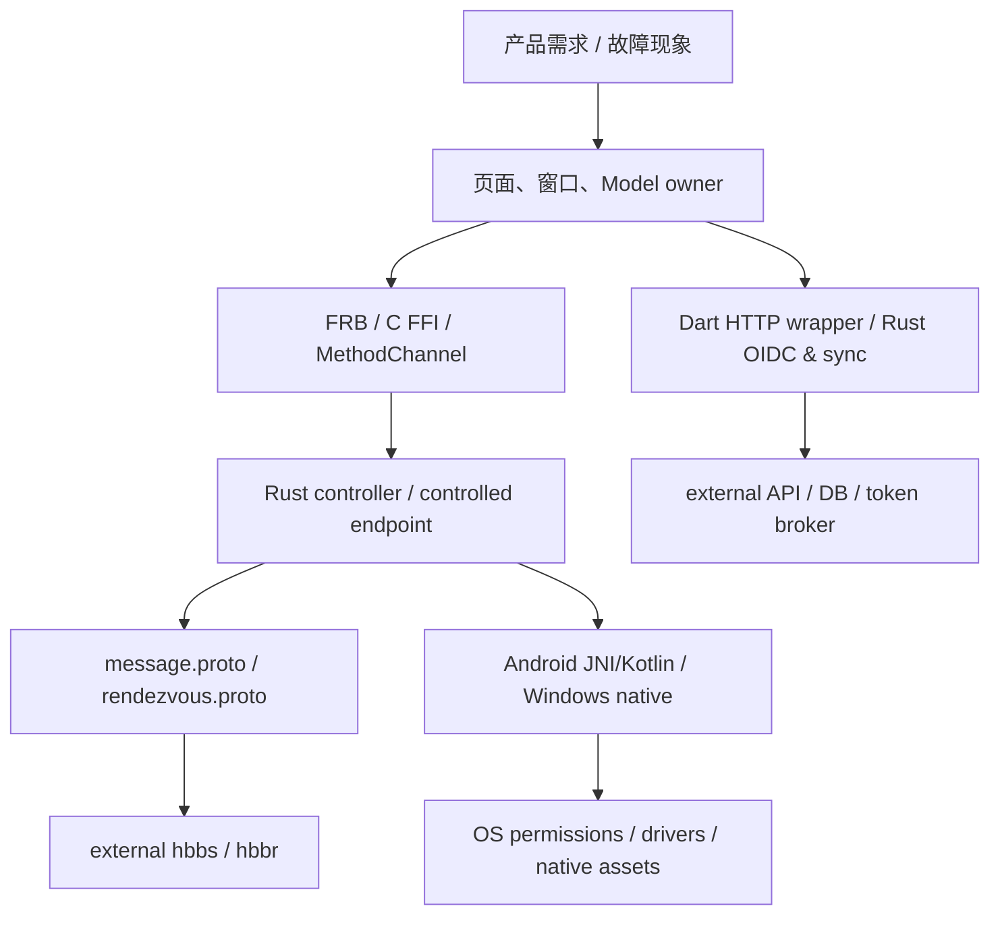

# Tunnel 功能定位与跨层对接地图

2026-10-03 T004配对入口：PC android_adb_menu/可拖动android_adb_pairing_dialog → 独立android_adb_pairing_model → android-control → RemoteAdbPairing。手机ADB页移除，内部suite保留；ADB状态在右上TunnelStatusMonitor；已配对重连需PC显式authorize。下文旧本机UI条目不代表当前导航。

> 2026-10-03 当前增量（T-2026-10-03-001 / V0）：远程ADB已从计划转为源码链；顶栏android_adb_menu→android_mode_model→sessionPeerOption保留命令→AndroidControl→TunnelAdbRuntime→helper；返回视频走encoded.rs/decoder/barrier。侧按钮由InputModel按已提交owner分流。运行能力/限制与入口详见指南。 [实现、构建与验收](../plans/ADB_REMOTE_IMPLEMENTATION_GUIDE.md)。以下2026-10-02及更早的阶段描述以本增量和当前源码为准。

复核日期：2026-10-02；Baseline：`CS-BL-2026-10-02-5cee692`；证据：V0。
用途：收到产品修改需求时确定入口、对接两端和验证范围。状态表示源码可达性/编译条件，不表示发布包或运行已验证。完整行为仍以对应领域文档和源码为准。

## 1. 从需求到领域

语义 owner：Flutter 管 UI/state；Android 管 OS/service/permission；Rust 管 ownership/ABI/实现；Network 管 peer 协议/会话权限；API 管产品 HTTP/schema/token；Security 与 Release 审查跨域边界。两个以上领域由 `tunnel-master` 整合。

## 2. 功能入口表

表内路径均相对仓库根目录。测试 ID 来自 [TEST_MATRIX.md](../../TEST_MATRIX.md)，均为待选择的回归要求，不能当已通过结果。

| 功能 / 当前状态 | 用户或系统入口 → 核心对接 | 修改时必须同时核对 | 领域文档 / cases |
|---|---|---|---|
| 启动与角色：active/cfg | Sciter走`src/main.rs`→`core_main`；Flutter Windows走`flutter/windows/runner/main.cpp::wWinMain`→`tunnel_core_main_args`→`core_main`；`flutter/lib/main.dart`再分窗口/角色 | process args、native runner、engine/window ID、全局与 session model | [03](03_MODULE_DESIGN.md)；FLT-02、RST-06 |
| 主远控连接：active | Flutter connection UI → `src/flutter_ffi.rs` / `src/ui_session_interface.rs` → `src/client.rs` → `src/client/io_loop.rs` | relay policy、login、事件归属、关闭/重连、服务订阅 | [06](06_NETWORK_PROTOCOL.md)；NET-01/02/04、E2E-01 |
| ID/在线状态：active | `src/rendezvous_mediator.rs::RendezvousMediator::start_all` → 外部 hbbs；Flutter `ServerModel` 查询 connect status | 注册状态≠core存活；endpoint direct/NAT 兼容仍在 | [06](06_NETWORK_PROTOCOL.md)；NET-02/08 |
| Android core：active | `runMobileApp` / `ensure_core_service` / `BootReceiver` → `MainService` → JNI/Rust | config path 异步、显式/非显式 destroy、GlobalRef；不把 core 操作变成 projection 授权 | [04](04_ANDROID_PIPELINE.md)；AND-01、RST-03/04 |
| 开/关共享：active | Android `start_screen_share` → Activity；PC `start_capture2` → MainService restore；需要新授权才进permission Activity/startCapture。Android关闭`stop_screen_share`→`stopScreenShareOnly`；PC关闭→`stopScreenShareAndStartIgnore` | permission in-flight、Android 14+ token、close两路差异、settle window | [04](04_ANDROID_PIPELINE.md)；AND-01/03、E2E-01 |
| 正常视频：active | ImageReader / platform Capturer → `libs/scrap/` → `src/server/video_service.rs` → `VideoFrame` → decoder → RGBA/texture | DirectBuffer owner、codec/QoS、真实首帧、source切换、资源回收 | [03](03_MODULE_DESIGN.md)、[04](04_ANDROID_PIPELINE.md)、[05](05_WINDOWS_PIPELINE.md)；AND-02、RST-04、WIN-01 |
| waiting / Android 自动重连：active | `flutter/lib/models/model.dart::FfiModel` → `sessionRefreshVideo` / `sessionReconnect` → Rust | 2.5s单timer、60s行为、密码来源、真实RGBA/texture清waiting；不能自动切ignore | [04](04_ANDROID_PIPELINE.md)；AND-02/04、FLT-03/04 |
| 穿透/无视/单次截图：active/Android API gate | `overlay.dart` → InputModel → MouseEvent → endpoint → `pkg2230.rs` → Accessibility/MainService | SKL/shouldRun/one-shot与normal是不同帧源；锁屏/projection callback fallback另有条件 | [04](04_ANDROID_PIPELINE.md)；AND-02/03/05 |
| 黑屏/防触/Dev自动点选：active | `flutter/lib/common/widgets/overlay.dart` → command masks → JNI → `nZW99cdXQ0COhB2o.kt` / `DevAutoSelectorController.kt` | BIS/亮度/overlay/输入恢复；UI密码不等于endpoint权限；联系人/节点数据敏感 | [04](04_ANDROID_PIPELINE.md)、[10](10_SECURITY_MODEL.md)；AND-05、NET-04 |
| 键鼠/触摸/键盘：active | `input_model.dart` → `session_send_mouse` / `session_input_key` / `session_handle_flutter_key_event` / `session_handle_flutter_raw_key_event` → `connection.rs` → desktop input_service/enigo 或 Android JNI | Android与desktop permission gates不同；coordinate/keyboard mapping、view-only、UAC | [03](03_MODULE_DESIGN.md)、[06](06_NETWORK_PROTOCOL.md)；AND-05、WIN-02、NET-04 |
| 剪贴板/文件剪贴板：platform gated | `src/clipboard.rs` / `src/clipboard_file.rs` → Message/CLIPRDR → `libs/clipboard/` | Clipboard vs MultiClipboards分别查permission；文件路径、取消、OS清理 | [03](03_MODULE_DESIGN.md)、[06](06_NETWORK_PROTOCOL.md)；RST-05、NET-06、E2E-04 |
| 文件管理/传输：active | Flutter FileModel → client/file_trait/io_loop → FileAction/FileResponse → endpoint → `hbb_common::fs::TransferJob` | 读写/覆盖/路径/摘要/压缩/中断、平台权限；没有独立session root sandbox | [03](03_MODULE_DESIGN.md)、[06](06_NETWORK_PROTOCOL.md)；RST-05、NET-06、E2E-04 |
| 终端：active/platform gated | `terminal_connection_manager.dart` / `terminal_model.dart` → TerminalAction → `connection.rs` → `terminal_service.rs` / PTY | 已有进程内persistent registry与reattach；不是跨进程/重启持久化保证；service_id owner边界需验证 | [03](03_MODULE_DESIGN.md)、[06](06_NETWORK_PROTOCOL.md)；RST-05、NET-04/06 |
| TCP tunnel / RDP：active/platform gated | Flutter port-forward UI → `src/port_forward.rs` → LoginRequest.PortForward → endpoint outbound TCP | 本地listener绑定、认证与connect执行顺序、目标host/port、凭据日志/关闭 | [06](06_NETWORK_PROTOCOL.md)、[10](10_SECURITY_MODEL.md)；NET-04/06 |
| Android ADB：active native / PC typed UI，runtime未验 | PC `android_adb_pairing_dialog.dart` → `android_adb_pairing_model.dart` → AndroidControl → `RemoteAdbPairing` → `TunnelAdbManager` → Runner/DNS → `libadb.so` | PC pair/authorize/revoke，本机独立连接端口与fresh shell probe；内部shell/helper保留，手机UI已移除，native固定来源由构建供应 | [04](04_ANDROID_PIPELINE.md)；ADBP-01—12 / ADBM |
| ZEGO 语音：active / external SDK+broker | `Data::NewVoiceCall` → token helper → VoiceCallRequest/Response → `ServerModel` / `ZegoVoiceCallModel` → SDK | invitation、token授权、麦克风同意三域；auto-accept、stale busy、token日志、room/first-audio | [04](04_ANDROID_PIPELINE.md)、[06](06_NETWORK_PROTOCOL.md)、[07](07_API_SYSTEM.md)；AND-07、NET-07、API-08、E2E-05 |
| Windows capture/input：active/cfg | `video_service.rs` → portable/DXGI/GDI；`input_service.rs` → enigo/SendInput | GPU/fallback、secure desktop/UAC、installed/portable、shared-memory contract | [05](05_WINDOWS_PIPELINE.md)；WIN-01/02 |
| Windows privacy：active/cfg | peer privacy request → `privacy_mode.rs` → topmost/exclude/Magnifier/virtual display | connection owner、DLL injection、hook、超时、guard与失败返回、显示/输入恢复 | [05](05_WINDOWS_PIPELINE.md)；WIN-03/04/06、E2E-02 |
| Windows virtual display：Amyuni active | `virtual_display_manager.rs::IDD_IMPL` → Amyuni IOCTL/外部driver | `amyuni_virtual_displays` 与 dormant RustDesk IDD语义分开；显示计数不是系统真值 | [05](05_WINDOWS_PIPELINE.md)；WIN-04/05 |
| Windows remote printer：conditional | `server::new` → printer adapter/service → Printer FileJob → controller `PrintXPSRawData` → OS XpsPrint.dll | driver/adapter外部、大小/内存、选项/consent、handle cleanup | [05](05_WINDOWS_PIPELINE.md)；WIN-07 |
| 产品账号 / 资格：active | login UI → `UserModel.login` / `validateUser` → HTTP wrapper → API；本地options/cache | 账号/资格/时间/UUID与远控密码分开；先写本地user再校验的失败清理 | [07](07_API_SYSTEM.md)、[10](10_SECURITY_MODEL.md)；API-01/02、E2E-03 |
| Rust OIDC：独立账号链 | UI OIDC entry → `src/hbbs_http/account.rs` → auth/query/cancel | issuer、remember_me存token、Dart后续资格校验、logout清理 | [07](07_API_SYSTEM.md)；API-01/02 |
| 地址簿/设备组：active/client-side | `ab_model.dart` / `group_model.dart` / Peer models → `utils/http_service.dart` → Dart HTTP或Rust代理 | cache/分页/schema/冲突、write权限仅客户端证据、同URL代理结果冲突 | [07](07_API_SYSTEM.md)；API-03/05 |
| heartbeat/config/disconnect：active | rendezvous startup → `src/hbbs_http/sync.rs` → 外部API | metadata、server-driven control、鉴权/TLS、重试/版本；需后台contract | [07](07_API_SYSTEM.md)；API-04 |
| 下载/更新：active/conditional | Flutter update UI / Rust downloader → `downloader.rs` / platform executor | HTTP状态/大小/路径/partial cleanup、签名/hash/执行边界 | [07](07_API_SYSTEM.md)、[10](10_SECURITY_MODEL.md)；API-06 |
| Record upload：dormant | `src/hbbs_http/record_upload.rs`；ENABLE初值false，未见开启路径 | 启用前需consent、token/TLS、retention、外部contract | [07](07_API_SYSTEM.md)；API-07 |
| 插件/CLI/Sciter/Web/其他OS：conditional/retained | `src/lib.rs` cfg/features、`src/plugin/`、`src/ui/`、`src/cli.rs`、`flutter/lib/web/` | 源码存在≠当前发布支持；可达性、旧命名、桥和依赖按feature逐项证明 | [03](03_MODULE_DESIGN.md)、[08](08_BUILD_SYSTEM.md)；RST-01/06 |

## 3. 协议/桥对接契约

| 修改类型 | 必查的 producer → contract → consumer | 不应遗漏 |
|---|---|---|
| Rust/Dart API signature | `src/flutter_ffi.rs` → `bridge_generated*.rs` / `generated_bridge*.dart` → Dart调用 | 正式FRB codegen、C ABI、各engine注册；不手改generated结果 |
| Android平台调用 | `PlatformFFI` / Dart wrapper → mChannel method/arguments → `oFtTiPzsqzBHGigp.kt` → Service | result/error语义、异步完成时序、权限来自哪个用户动作 |
| Android raw/JNI | Kotlin `pkg2230.ClsFx9V0S` → JNI exports → `VIDEO_RAW` → Rust Capturer | 活跃`pkg2230.rs`、compat `ffi.rs`差异、DirectBuffer owner、thread cleanup |
| Android侧按钮 | overlay → InputModel → FFI → ui_session_interface → client MouseEvent.mask/url → connection → JNI → Kotlin | mask编码/服务端权限/未知command/旧客户端；语义不靠UI标签推断 |
| Session message | controller/endpoint producer → `message.proto` → receiver `on_message`/io_loop | field number、oneof/default、登录前后边界、取消/重复/未知消息 |
| Rendezvous | mediator/client → `rendezvous.proto` → 仓外hbbs/hbbr | 本仓仅客户端契约；server版本/部署/容量/密钥不能推测 |
| HTTP | Dart/Rust request → 外部schema/auth → response/cache/UI | status/timeout/size/retry/idempotency/token redaction；后端实现未提供 |
| 品牌/构建身份 | Cargo/config → SO/DLL → native loader/CMake/JNI → Gradle/manifest/deep link → scripts | 保留必要RustDesk兼容锚点；不做全仓品牌替换 |

## 4. 故障定位速查

| 现象 | 先查 | 然后查 / 不要跳过 |
|---|---|---|
| 无ID/离线 | rendezvous注册状态与MainService/JNI分别观察 | backend/relay配置和日志；不可用UI ready替代真实状态 |
| 已连接但无画面 | core / share / frame source / PC waiting四层 | normal refresh、ImageReader→JNI→codec→RGBA/texture；不通过自动ignore掩盖 |
| Android重连反复弹权限 | legacy/hidden restore调用参数 | permission in-flight、token失效、显式share按钮路径 |
| 输入开关关了仍能操作 | endpoint `Connection::on_message`的实际分支 | Android JNI shortcut、Mouse/Pointer/Key/custom mask gates |
| 语音显示连接但无音频 | invitation→token→join→publish/play→first audio | microphone consent、SDK事件、mediaReady；不以通话UI代替媒体事实 |
| 账号被拒绝但UI已登录 | UserModel本地写入与资格校验顺序 | Rust OIDC token持久化、失败logout/reset；后端授权单独核验 |
| 隐私模式报成功但保护不完整 | mode owner / hook返回 / guard标记 | topmost DLL实际行为、virtual display topology、失败恢复 |
| 换机器无法构建或ADB缺失 | 08、Baseline与External Registry | ignored/missing native assets、工具链、锁漂移、脚本副作用 |

## 5. 下一次需求的最小工作包

1. 用上表定位功能和实际可达入口，记录当前HEAD/dirty与问题证据。
2. 选最窄领域 Skill，列调用两端、状态owner、权限/兼容与外部依赖。
3. 在 Task artifact 写验收、方案、rollback、TEST_MATRIX cases；确认产品取舍后改实现。
4. 静态检查与正式验证分开；实现事实同步对应00—10/地图行，历史任务追加、memory更新指针。

本轮覆盖细节及尚未深入验证的 retained 平台见 [接管报告](audits/2026-10-02/README.md)。
