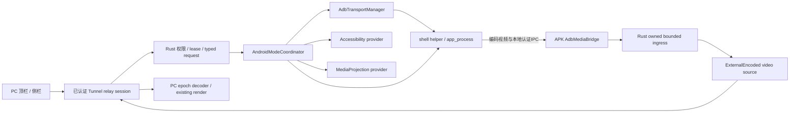

# Tunnel 远程 ADB 投屏：架构方案、实施路线与使用教程

日期：2026-10-02；任务：[T-2026-10-02-002](ADB_REMOTE_MIRRORING_TASK.md)。

状态：2026-10-03用户要求先完成全链源码、后在外部服务器集中编译。T001已接入PC/relay受控入口、helper视频/输入、模式及本机同意；当前实现和限制见[交接指南](ADB_REMOTE_IMPLEMENTATION_GUIDE.md)。原P0验证记录保留；P0—P6运行验收全部待执行，下文目标合同不等于已全部PASS。

原规划源码：`test / 532637a7b4084ec8ebf7deddbab12982628b1c1c`；当前实现基线 `TUN-BL-2026-10-03-ADB`。所有开发在独立worktree；远程入口需用户主动请求和手机本机同意，不自动授权。

## 1. 结论与验收边界

推荐架构：**APK 内本地 ADB → 固定版本的 shell helper → Android 采集/硬件编码 → APK 二进制接入 → Rust 既有 relay 视频会话 → PC 当前远控窗口**。ADB 权限在手机本地取得，PC 发送经授权的有限操作，不在公网连接手机 adbd，也不开放远程任意 shell。

这条基础路线已有 scrcpy 的 shell 进程、屏幕采集、编码和输入实现依据，不需要发明新的 Android 录屏原理。[scrcpy 官方开发说明](https://github.com/Genymobile/scrcpy/blob/v4.1/doc/develop.md)说明了这些组件；本项目需要自行完成安全封装、视频接入和跨模式协调。

以下三类结论必须分开：

| 分类 | 本轮可得出的结论 |
|---|---|
| 已核实 | 当前本地 ADB 包装、既有视频协议/客户端解码/中继、侧按钮真实含义和缺口，可定位源码 |
| 有实现依据的设计 | shell helper 采集、typed 控制、唯一输入 owner、事务切源、能力驱动 UI；本文件给出明确实现合同 |
| 需要原型/设备证据 | 具体 ROM/ABI 编码与注入、无障碍设置写入、节点捕获、设备熄屏、防触效果；只有对应 case PASS 后才列入支持清单 |

不能在未构建、未运行设备的情况下证明“所有手机、所有按钮、所有应用都完美支持”。本计划用前置原型和逐项验收消除不确定性，不把未知写成已实现。特别是：

- “无限调试”按“无线调试”理解。配对不是永久在线，用户可撤销授权；应用 UID 不会因 ADB 配对变成 shell/root。无线配对入口面向 Android 11+；旧系统需另一套激活流程，首期不纳入。[Android ADB](https://developer.android.com/tools/adb)
- `FLAG_SECURE`/受保护内容不能列为 ADB 保证突破的功能。“无视”“穿透”保留产品名称，但技术定义分别是截图帧源、节点重绘。[Android FLAG_SECURE](https://developer.android.com/reference/android/view/WindowManager.LayoutParams#FLAG_SECURE)
- 系统关闭 Tunnel 无障碍后，不再调用它提供的截图/节点/overlay；ADB 对应 provider 独立通过验证才可启用。
- MediaProjection 释放后不能保证无提示恢复。Android 14+ 的授权/session 约束要求真实用户同意；失败回退不能偷偷复用失效 token。[MediaProjection](https://developer.android.com/media/grow/media-projection)

首批假设：Windows 10/11 PC + Android 11 及以上手机；按目标机型实际验证，优先 arm64-v8a。Android 10 及以下、root、电视、车机、工作资料/多用户、跨设备 ADB 暂不纳入首版。具体品牌/版本由 owner 补充，不把这个假设当正式兼容认证。

## 2. 九项需求到设计与验收

| 用户需求 | 方案 | 完成判据 |
|---|---|---|
| 1 本地无线调试授权 | 原 ADB 页配对；transport + shell 身份 + helper 能力分层探测 | 非 ADB `sh -l`、历史 paired、撤销授权均不能误报可投屏 |
| 2 PC 请求 ADB 视频 | 顶栏 typed request，经原 relay 会话到 APK；编码帧接入原 PC render | 同窗口显示新 source epoch 的真实首帧后才成功 |
| 3 暂停/恢复无障碍 | 独立 runtime pause/resume；另设系统 enable/disable | 暂停不取消系统授权，ADB 不被停止 |
| 4 无视/穿透等侧按钮 | 按第9节逐项配置 Accessibility/ADB provider | 功能效果测试通过才开放；不把按钮存在当支持证明 |
| 5 模块化无冲突 | transport lease、唯一 mode actor、分离媒体/命令、有限队列 | 页面关闭/子进程失败不破坏其他功能；故障测试可恢复 |
| 6 智能执行分流 | endpoint 根据实际 backend、frame mode、能力选择 provider | PC 不拼 shell，不按按钮文本推断权限，不重复输入 |
| 7 正常接管和切换 | PREPARE→首帧确认→COMMIT；失败撤销本事务 | 无旧帧闪回/旧坐标误触/假成功，授权失效有明确恢复路径 |
| 8 PC 顶栏入口 | `RemoteToolbar` 中新增 ADB 菜单、进度、来源和原因 | 旧端/离线/权限不足可解释禁用，多窗口状态隔离 |
| 9 共存、关闭及开启无障碍 | capture/input 与 service 分离；只管理本应用组件 | 无障碍关闭后 ADB 视频/输入继续；其他服务不被修改 |

完整九项兼容版需要 P0—P6 全部通过；P2 的基础投屏版本不能标为全部交付。

## 3. 当前源码证据及缺口

下列行号固定于上述 HEAD；后续以符号复查。路径相对仓库根目录。

| 当前事实 | 源码锚点 | 实施影响 |
|---|---|---|
| ADB binary 从 nativeLibraryDir 加载 | `flutter/android/app/src/main/kotlin/com/tunnel/app/adb/TunnelAdbRunner.kt:44` | worktree 的 `jniLibs/` 当前缺失；已安装 APK 是否含产物需运行证据，不据此否定用户已有 APK |
| paired 包含历史信息 | `TunnelAdbManager.kt:27,119` | 不能表示当前 transport/授权有效 |
| 普通 app shell 也可 shellReady | `TunnelAdbRunner.kt:157,273,288` | ready 必须改为真实能力探测 |
| 文本 shell 与自动 grant | `TunnelAdbRunner.kt:238,297,397,417` | 视频不能走 readText/交互 shell；权限申请需明确同意和回读 |
| 启动/停止/重连会影响全 server | `TunnelAdbRunner.kt:74,184,214,230,454,520,544` | 先解耦 kill-server、wireless cycle，才能承载多功能 |
| PC 顶栏/侧栏 | `flutter/lib/desktop/widgets/remote_toolbar.dart:449,577,599`；`flutter/lib/common/widgets/overlay.dart:324` | 新顶栏菜单和统一动作描述 |
| session model、状态与销毁 | `flutter/lib/models/model.dart:3111,3122,3337,3678` | 新 session-owned model；旧 JSON status 不是 ADB 权限证据 |
| 无视：无障碍 screenshot | `nZW99cdXQ0COhB2o.kt:845,2449` | 新 ADB screenshot provider |
| 穿透：节点绘图 | `nZW99cdXQ0COhB2o.kt:805`；`EqljohYazB0qrhnj.kt:69,106` | 抽纯 renderer + ADB NodeSnapshot |
| 关闭 service 会移除 overlay/截图任务 | `nZW99cdXQ0COhB2o.kt:2632`；`oFtTiPzsqzBHGigp.kt:386` | 软件暂停与 disableSelf 不同 |
| 已有 H264/H265/VP8 压缩帧 | `libs/hbb_common/protos/message.proto:4,25,635` | 可复用 VideoFrame，不能因此假定每台 PC 都可解码 |
| 当前 server 走 raw→encoder | `src/server/video_service.rs:477,645,1050` | 新 ExternalEncoded source，不把 H264 塞进 VIDEO_RAW |
| 当前 codec 协商包含本机 encoder 判定 | `libs/scrap/src/common/codec.rs:164,200,324` | 外部 helper encoder 单独参与协商 |
| 视频发布可复用 | `src/server/service.rs:231` | 仍需权限、source/epoch、订阅和 QoS 接口 |
| 收发存在无界队列/同TCP流 | `src/server/connection.rs:69,368,416,826`；`src/client.rs:99,2710` | bounded ingress 不足；egress/关键帧积压也要控制 |
| 解码器首包要求 | `src/client.rs:1527,1550,2791` | 纯 codec config 不作为首幅视频成功/失败判据 |
| Android mouse/custom-command 权限差异 | `src/server/connection.rs:2315`；`libs/scrap/src/android/pkg2230.rs:1985` | ADB 新路径必须先做 endpoint 权限路由，不沿用旧命令直接提权 |

Android 短文件名均位于 `flutter/android/app/src/main/kotlin/com/tunnel/app/`；ADB 类位于其 `adb/` 子目录。完整旧链详见 [04_ANDROID_PIPELINE](../AI_ENGINEERING/04_ANDROID_PIPELINE.md)。

## 4. 技术选型

| 方案 | 结论 |
|---|---|
| 有限 fork 的 scrcpy-server + Tunnel relay | 推荐：复用 Android capture/input 适配，自有 APK/PC 协议和安全生命周期 |
| PC 直接连手机 adbd / 透传任意 ADB | 不采用：扩大权限和暴露面，绕开现有 session 与 relay 约束 |
| `screenrecord` 循环重启 | 仅诊断；不作为长期视频、旋转和按需关键帧实现 |
| 每帧 `screencap` + 子进程 | 仅低频诊断；主视频与截图兼容 provider 均采用长驻服务 |
| 把 MediaProjection 原始帧编码一次再转码 | 不作为主线：新增延迟、耗电和生命周期交叉 |
| 给普通 APK grant WRITE_SECURE_SETTINGS 就获得录屏能力 | 不成立：设置权限不改变 app 身份/采集权限 |
| 强制依赖外装 Shizuku | 首期不采用；可作为后续可选权限提供者 |

候选上游选 `scrcpy v4.1`，依据本次读取的[官方 release](https://github.com/Genymobile/scrcpy/releases/tag/v4.1)及对应 tag 源码。P0 必须固定完整 commit、源码校验、许可证/NOTICE、构建配方和 helper SHA-256；**本轮只选候选，未引入/下载可执行产物，也未宣称完成供应链准入**。不追随 `master`，不引入 scrcpy 桌面程序替换现有 Flutter 窗口。

有限修改范围：本地连接认证、自有 framing、显式 keyframe/参数控制、父进程/lease watchdog、capability/result；截图/节点/provider 独立模块。不复制整个 ADB 服务栈，不让 shell helper 加载本项目 `libtunnel.so` 和 MainService globals。

## 5. 总体架构与模块边界



以下均为**拟新增/拆分**的模块，名称不是已存在文件的声明：

| 模块 / 建议目录 | 唯一职责 | 不得承担 |
|---|---|---|
| `adb/AdbTransportManager` | 配对、target identity、本机 ADB server、transport lease | 页面退出时杀全部功能；持有UI |
| `adb/AdbCapabilityProbe` | 在线 shell 身份、helper/version/codec/input/settings 能力 | 用历史 paired 或 echo ready 代替探测 |
| `adb/AdbHelperSupervisor` | staging/hash、独立 shell 子会话、启动/取消/watchdog | 用户文本 shell、全局 kill-server |
| `adb/mirror/AdbMediaBridge` | 独立媒体socket、framing、长度校验、JNI owned复制 | Flutter MethodChannel搬运视频/日志混流 |
| `runtime/AndroidModeCoordinator` | 串行事务、actual/desired state、唯一capture/input owner | UI 自行写 SKL/shouldRun 等并发状态 |
| `runtime/InputRouter` | provider路由、坐标epoch、释放按键/触点 | 双路同时注入、长时shell等待 |
| `runtime/AccessibilityLifecycleController` | 本App暂停/恢复/系统启停、真实回读 | 重置其他service、停止ADB/core |
| `runtime/SideActionRouter` | typed action → 当前 provider；统一 capability/reason | 任意字符串命令 |
| `runtime/NodeRenderer` | bounded NodeSnapshot → owned bitmap | MainService/JNI globals、抓取权限 |
| `android-helper/` | shell采集/编码/输入/节点/显示电源，独立构建产物 | 产品账户、relay凭据、主App JNI上下文 |
| `libs/scrap/src/android/encoded.rs` | Rust-owned packet、边界/取消/epoch | 反向依赖根crate、保存失效Java指针 |
| `src/server/android_control.rs` | endpoint ACL、connection lease、typed result | 接受PC指定shell/service component |
| `flutter/lib/models/android_mode_model.dart` | 单session UI状态、operation与超时/dispose | 全局“当前Android”变量、执行权限判定 |

`MainService` 和 Rust core 保持存活：projection stop、关闭无障碍、停止 ADB 投屏都不代表停止 rendezvous/relay/JNI。只关闭本 feature 的资源。现文本终端使用独立 lease，用户主动“停止本机 ADB”时才提示并结束所有 ADB feature。

## 6. ADB 权限、连接和 helper 生命周期

### 6.1 真实能力探测

区分 `binaryAvailable → transportConnected → shellIdentityVerified → helperCompatible → capture/input/... available`。`paired_before` 只用于提示，不作为授权凭证。普通 `sh -l` 不参与 remote capability。

每次探测使用独立有 deadline 的子会话，固定 target serial，不选“第一个 device”。bootstrap前只接受本机loopback或已核实属于当前手机接口的地址，不能选择任意已有ADB device。检查 transport 当前状态、命令 exit/result、shell UID（通常2000，首期不接受未知/root路径）、helper nonce 握手、codec 列表与实际初始化。

本机绑定通过 helper 连接 APK 的 loopback listener 完成挑战校验。最小bootstrap例外仅允许在上述本机target上staging并启动受信任helper；认证前helper不采集、不注入、不修改设置、不grant，超时退出。认证成功后才开放功能和发布capability。不能用“错误设备无法握手”掩盖此前任意远端执行helper的副作用。APK仍是app UID，shell权限只存在于受控helper/命令上下文。

capability 带 generation、探测时间、失败原因和过期状态；transport断开、授权撤销、helper重建、系统service变化立即失效。推荐状态变更主动推送 + 可配置低频健康检查，替换新增功能中的100ms双轮询。

### 6.2 进程与本地 IPC

1. APK 从受信任资源取得固定 hash helper，使用本机 ADB staging 到 shell 可读、非 world-writable 的专用目录；成功校验后原子替换。路径固定并校验 symlink/owner/权限，不接受PC文件路径。
2. APK 先 bind `127.0.0.1:0` 的短期 listener，再使用独立无PTY adb shell 启动 `app_process`。启动语法固定，token 经受控 stdin bootstrap 输入，不放命令行、日志或持久配置。
3. helper/APP 双向 nonce/challenge-HMAC 认证，每实例随机256-bit secret；带协议版本、角色、source epoch。复用经过审查的密码库，不自创加密算法。loopback不是身份，随机端口不是授权。
4. 媒体/control分连接或独立有界通道；认证后才接收typed帧。限制未认证连接数、握手时间、包长和速率；stderr 持续读取并限量脱敏，不能并入视频stdout。
5. APK与helper分别维持 heartbeat和租约。EOF、进程退出、lease撤销立即停止input并释放输入状态；超时也由helper本身退出/恢复显示，不能依赖已崩溃APK清理。
6. 模式切换、ADB页关闭、普通shell退出，不调用kill-server、不cycle无线调试、不清配对密钥。重连采用单owner、代次检查、有上限退避；失败如实通知，不无限重启。

loopback避免把跨SELinux Unix `connectto` 作为唯一路径；它不是“所有ROM自动可用”的证明，仍属于P0真机门。[scrcpy DesktopConnection](https://raw.githubusercontent.com/Genymobile/scrcpy/v4.1/server/src/main/java/com/genymobile/scrcpy/device/DesktopConnection.java)仅作为上游socket生命周期参考，自有IPC需要新增。

## 7. 视频接入和有界传输

### 7.1 编码与解码

首选 H.264，由 helper 实际可用encoder与PC实际decoder取交集；不能使用 Android 当前 raw encoder 的能力替代 shell encoder。推荐起点：最长边1280、30fps、4Mbps，再按反馈调整，均为目标配置而非测得性能。

PC没有可用H264 decoder时：P0验证VP8候选后才提供协商降级；否则返回 `CODEC_UNSUPPORTED` 并保留原视频。v4.1增加VP8/VP9，但不等于本项目该路径已验证。[官方v4.1说明](https://github.com/Genymobile/scrcpy/releases/tag/v4.1)

主视频保持编码直通：不在APK解码再编码、不经Dart传视频。JNI同步复制至Rust-owned buffer，或以后用可证明生命周期的owned handle；首版优先复制正确性。读完MediaCodec buffer后必须释放，禁止保留已释放DirectBuffer指针。

helper自有packet包含 protocol version、kind、epoch、config revision、codec、coded/logical尺寸、rotation/crop、sequence、单调PTS、key/config标志、payload length。所有尺寸乘法checked，限制像素和payload。PNG/bitmap/日志不能误入编码AU。

对H264规范化 Annex-B access unit，处理SPS/PPS、AVCC/Annex-B差异、多NAL和partial/config output。先缓存config，首个可解码IDR与必需config共同进入decoder；修复/适配“decode暂未产出像素即判不支持”的旧逻辑。PTS从helper微秒明确换算到本项目毫秒会话时基；跨源偏移保持单调，录制/同步用同一映射。

不要照搬旧版scrcpy头：v4.1 `Streamer` 有session/config/key标志与独立尺寸记录；本项目在helper边界转换成自己的版本化消息，并以选定tag的contract fixtures验收。[v4.1 Streamer](https://raw.githubusercontent.com/Genymobile/scrcpy/v4.1/server/src/main/java/com/genymobile/scrcpy/device/Streamer.java)

### 7.2 server 与 client 改造

- `video_service` 引入 `RawCaptureAndEncode / ExternalEncodedCapture`，保留正常路径；不要让encoder协商把外部H264误切回原VP9。
- 新source仍使用订阅/权限/QoS/发送框架。refresh/new viewer/旋转/decoder reset改为向helper请求IDR+config；不能用重建raw encoder替代。
- `VideoStreamConfig`/切换barrier必须与视频走同一有序视频队列；每包仍带epoch/config，不能依赖另一路control ack先到。
- PC按epoch维护pending/active decoder，切换时清理旧P帧、关键帧队列和decode work；旧epoch禁止重新进入render。
- 帧source变更时同步截图、录制、分辨率/QoS、光标/input transform。录制首期按新epoch分段并明确提示；无法支持的旧截图/录制入口禁用，不能读取stale raw buffer。
- screenshot/hierarchy frame mode产生的owned bitmap走统一raw encode入口；不与live encoded source同时发布。backend/frameMode、encoder重启、codec/CSD、影响坐标的尺寸/旋转/crop改变都创建新epoch并执行barrier/reset。仅不改变decoder/input合同的纯码率调整可保留epoch并递增config revision。

### 7.3 背压、输入延迟和性能预算

初始工程预算（需要压测调整）：最大AU 8MiB；每source ingress及每subscriber egress双限制3个AU/12MiB，排队时间上限250ms；metadata/control小包另设字节/条数/执行deadline。超过上限拒绝/降规格/触发IDR，不无限增长。8MiB是内存安全硬限，不保证控制延迟；另按估计带宽/发送时间设动态软限，超预算降低码率/尺寸，已写入TCP的AU无法抢占。

丢弃依赖帧后不能继续发送同GOP后续P帧；暂停该GOP、请求下一IDR及config。已开始写入TCP的消息不能截断；仅丢尚未发送的完整消息。慢observer隔离、超时取消，不能拖死全部订阅者。client关键帧队列也必须有界。

controller/input处理线程不等待长shell任务。pointer move可合并；down/up/cancel必须可靠成对，溢出或失序执行release-all。已有同一TCP视频流存在网络层队头阻塞；公平/优先调度、码率和包长限制能缓解，不能宣称消除。后续若SLA要求独立传输，另设绑定同一认证session的relay通道，不公开ADB。

## 8. 状态机、接管与失效恢复

### 8.1 正交状态

```text
adbTransport: missing | needsPairing | connecting | verified | lost
controlProfile: standard | adb
actualFrameSource: mediaProjection | accessibilityScreenshot | accessibilityHierarchy |
                   adbEncoded | adbScreenshot | adbHierarchy | none
captureBackend: mediaProjection | accessibility | adb | none
baseMode: live | stopped
frameOverride: none | screenshot | hierarchy
frameMode: live | screenshot | hierarchy | stopped
inputBackend: accessibility | adb | none
accessibility: enabledInSettings + serviceBound + runtimePaused
transition: operationId + expectedGeneration + desired + actual + phase
stream: sourceEpoch + configRevision + sequence + displayTransform
authority: connectionLease + scopes + expiry + revoked
```

普通模式预设通常是MP live + Accessibility input；ADB预设是ADB live + ADB input，但**切入ADB默认保留无障碍系统开关不变**。用户再选择暂停或关闭。模式不是一个万能布尔值。

`AndroidModeCoordinator` 是唯一状态写入者；旧 `SKL/shouldRun/_isStart` 通过兼容adapter受控读写。旧JNI custom-command不得先改全局状态再绕过router执行。actual状态来自资源事实，不由PC期望值直接赋值。

### 8.2 普通 → ADB 的事务

1. 检查session、安全通道、用户ADB授权、owner lease、expected generation和codec；冲突请求返回BUSY/STALE，不叠加timer。
2. PREPARE：保持旧源；启动新helper并验证config+IDR。准备阶段有上限，最多短暂保留两个producer，只有一个committed source。
3. 向owner的pending decoder发送带candidate epoch的config和首AU；candidate只离屏解码，不呈现。PC反馈 `VideoCandidateReady`，旧画面/旧输入仍保持对应；不能拿旧流RGBA或普通status作为新源成功。
4. 输入barrier：endpoint停止接受旧输入并release所有keys/pointers；PC确认冻结input，丢弃排队手势。验证新display transform后才发送同视频队列的 `ActivateBarrier`。
5. PC处理barrier，原子切active decoder、显示纹理和input transform，仍冻结输入；新帧进入实际render完成路径后发送 `VideoFramePresented`。endpoint核验后才启用新input、宣布COMMITTED并释放旧producer。
6. ACK绑定operationId、owner lease、epoch、config revision和sequence。Ready只证明解码，Presented必须来自本项目实际UI/render完成边界，不以on_rgba/纹理排队充当完成；P0落实这一观测点。重复barrier/ACK幂等，取消后的迟到ACK不能提交。
7. ActivateBarrier之前失败可直接清candidate；之后失败必须保留输入冻结，以新的epoch和RollbackBarrier恢复旧producer/transform，再确认呈现。旧epoch不重新启用。COMMITTED后旧MP已释放时不能虚构它仍可恢复。

旧source释放必须传明确 `SWITCH_COMMIT / USER_STOP / PROJECTION_LOST` reason。SWITCH_COMMIT仅释放其资源，禁止调用旧 `stopScreenShareAndStartIgnore()`；迟到projection/screenshot回调检查generation。用户显式关共享转截图保留为另一条intent，不能在ADB接管后意外启动无障碍截图。

临时双源验证需要新增pending decoder/source分流；现有单decoder并不天然支持。原型必须证明短时资源预算。若设备不能并行两个encoder，P0记录该profile采用冻结最后一帧、停旧encoder后切源的受控策略，并明确中断时长/回退需授权；不得称为无缝。

### 8.3 ADB → 普通

先验证无障碍输入是否可用；仅暂停过的可按用户本次选择恢复，不擅自开启已被系统关闭的service。保留ADB视频直到普通源真实就绪。

有存活MP可准备接管；没有有效MP时，PC只发送恢复请求，Android显示本机明确“开启普通共享”操作入口。由本机用户操作触发授权流程，不能让waiting/reconnect/背景探测弹授权。拒绝则留在ADB；如果ADB也失效，显示最后一帧的“已暂停”标记和本机恢复提示，不显示实时成功。

ADB模式下“关共享”定义为停止当前backend的live帧源，不关闭ADB transport/core。若用户明确配置“关共享转截图”，只在同backend截图能力已验证时切换；它与断线/waiting自动切截图严格分开。全局“停止所有投屏”直接停止所有frame mode。

### 8.4 多PC、重连与异常

首版只允许**一个远控视频会话占用ADB source**；当前其他视频subscriber存在时返回 `MULTI_VIEWER_UNSUPPORTED`。检查subscriber、取得pending/active lease、安装订阅过滤必须是同一串行事务。PREPARING/ACTIVE期间拒绝其他视频订阅（含中途新登录者），不把ADB帧广播给它，也不让其codec update改变owner source；其独立文件等权限不受影响。未来支持observer时须全部满足协议/codec交集和独立egress预算，再单独验收。

lease绑定受认证connection实例+server generation，不能只绑定PC传入peer ID。连接断开立即撤销旧lease、停止输入接受、释放键/触点；默认5秒仅保留无输入权限的helper资源，到期停止ADB采集。同会话恢复授权可被验证时，新连接创建新lease/epoch；超窗需本机重新同意。不可恢复旧connection authority或重放旧operation。

保留现有PC单2.5秒重连timer、前60秒最后画面策略，增加ADB实际失效标签；两者不代表ADB仍在传实时画面。ADB模式waiting只请求当前helper IDR，不调用MP授权/无视/穿透。屏幕锁定、录屏中断、ADB撤销、helper death均通过coordinator收敛，不重启core。

## 9. 侧按钮兼容合同

PC发送动作枚举与期望状态（enable=true/false），不用非幂等toggle。endpoint按当前capture/input provider执行；所有结果包含真实状态和原因。旧peer继续原模式，不自动获得ADB权限。

frameMode由 `baseMode(live/stopped)` 与唯一 `frameOverride(none/screenshot/hierarchy)` 决定。开无视/穿透替换当前override；关闭非当前override是幂等no-op；关闭当前override返回baseMode，不使用无界历史栈。baseMode=stopped时退出override必须回stopped，不误开直播。关共享的明确转截图政策更新baseMode=stopped、override=screenshot；所有实际帧源变化走epoch事务。

| 功能 / 当前命令 | 现无障碍/MP实现 | ADB实现方向 | 发布条件与边界 |
|---|---|---|---|
| 开/关共享 `wheelstart`→`start_capture2` | 正常MP；关闭可转ignore | ADB live start/stop，保持transport | 接管事务与关共享政策通过 |
| 开/关无视 `wheelback`→`stop_overlay` | Accessibility screenshot loop | 常驻shell截图provider，低帧率owned bitmap→原编码链 | screenshot probe成功；不是secure突破；关当前override后回baseMode |
| 开/关穿透 `wheelanalysis`→JNI `start_capture` | AccessibilityNodeInfo重绘 | shell UiAutomation NodeSnapshot→APK纯renderer→raw encode | 节点可用/共存/坐标/golden case通过，见下节 |
| 开/关黑屏 `wheelblank`→`start_overlay` | 近黑overlay/亮度与raw像素补偿 | helper display-power，文案明确“设备熄屏” | 与旧overlay不完全等价；必须验证熄屏仍采集/输入及退出恢复，不套用raw反增益 |
| 开/关防触 `wheeltouch`→`touch_block` | Accessibility overlay吸收本机触摸 | 独立可逆overlay provider候选 | 无障碍系统关闭时，未验证独立provider就禁用；不能以熄屏冒充防触 |
| 浏览器 `wheelbrowser` | ACTION_VIEW | typed OpenUrl，固定action及http/https scheme校验 | 不允许远端传shell片段/Intent component/任意scheme |
| 返回/Home/最近任务 | performGlobalAction及旧mouse映射 | 长驻helper input/key事件 | 显式作用于当前display；OEM input gate成功 |
| 音量/普通键鼠触控 | Accessibility/input兼容路径 | helper受限input协议 | down/up、中文输入/键盘布局、旋转/缩放分别验收 |
| Dev selector开始/暂停/关闭 | 节点识别/点击自动化 | 独立nodeAutomation scope与provider | 不因capture ready自动开放；后续阶段独立验收 |
| `wheelstop` | 未证实活跃Dart sender+JNI专用处理 | 不复用 | 不当成既有停止协议 |

“JNI start_capture切SKL”和“Activity MethodChannel start_capture刷新普通共享”是不同入口；新增实现使用明确命名避免歧义。

### 9.1 穿透与节点源

`AdbHierarchyProvider` 通过shell侧UiAutomation读取节点；可以不依赖本App无障碍service，但仍使用系统accessibility subsystem。必须显式设置 `FLAG_DONT_SUPPRESS_ACCESSIBILITY_SERVICES`，不能用会禁止节点能力的 `FLAG_DONT_USE_ACCESSIBILITY`。[UiAutomation官方说明](https://developer.android.com/reference/android/app/UiAutomation#FLAG_DONT_SUPPRESS_ACCESSIBILITY_SERVICES)

同一系统accessibility子系统只允许一个UiAutomation注册；已有测试/自动化占用时返回 `TREE_BUSY`，不抢占、不kill，ADB live/input继续。[AOSP UiAutomationManager](https://raw.githubusercontent.com/aosp-mirror/platform_frameworks_base/master/services/accessibility/java/com/android/server/accessibility/UiAutomationManager.java)

将当前renderer对MainService/SCREEN_INFO/pkg2230的依赖抽离，输入统一NodeSnapshot（窗口/位置/层级/文本/可操作属性）。初始限制2048节点、深度64、文本总量256KiB；bounded快照、超时取消、event合并，退出释放UiAutomation。节点文本不进日志/诊断默认包。

绘制结果是语义视图，不是像素复刻：Canvas、视频、未暴露节点、密码/敏感文本保持系统可见性限制。旧无障碍节点与ADB节点用同一golden page对照，确定差异再决定支持范围，不靠按钮名称承诺“完全一样”。

### 9.2 防触和黑屏不能偷换定义

ADB live/input是基础路径；物理熄屏、overlay防触是独立设备效果。屏幕电源必须用幂等目标状态和真实结果，不用盲目POWER toggle。只有本feature改变的状态才能在退出时恢复，尊重用户后续手动变化。

独立防触provider的首选原型是App单独管理的application overlay（需用户本机授权），不依附AccessibilityService；必须验证系统触摸安全规则、远程注入可用、本机紧急退出与画面效果。若无法达到既有防触效果，该设备返回UNSUPPORTED并保持ADB视频，不能标完整兼容。该子功能是P5验收门，不是已证明跨ROM通用的能力。

## 10. 无障碍暂停、恢复、关闭、开启

| 操作 | 定义 | 成功证据 |
|---|---|---|
| 暂停无障碍功能 | 保持系统enabled/service bound；停止本App input、截图、节点/Dev自动化、临时overlay | runtimePaused=true，任务取消且ADB持续工作 |
| 恢复无障碍功能 | 恢复允许的任务；若ADB仍是input owner则无障碍不注入输入 | provider ready，不发生双输入 |
| 系统关闭本App无障碍 | 经明确授权只移除本App组件或使用自身disableSelf | 设置回读 + 实际unbind；ADB video/input已经可用 |
| 系统开启本App无障碍 | 仅在profile验证有安全的单组件更新能力时自动执行；否则引导本机设置 | 设置回读 + onServiceConnected；无安全机制返回LOCAL_ACTION_REQUIRED |

`disableSelf()` 是系统关闭，不能包装成pause；生命周期由系统管理。[AccessibilityService](https://developer.android.com/reference/android/accessibilityservice/AccessibilityService#disableSelf())

只允许本App声明的service component，不接受远端任意组件名。处理当前Android user，首版不跨工作资料/多用户。系统关闭优先自身disableSelf，不把global accessibility置0。整体enabled-list的read/merge/write/read没有CAS，不能保证不覆盖并发变更，回读也不能证明没有丢失更新；因此**严格共存模式不以整体settings put作为通用自动开启方案**。P0核实按组件安全更新机制；无此能力时按钮保留但返回LOCAL_ACTION_REQUIRED，由手机系统设置完成。不能假定cmd accessibility有通用原子enable命令。[Settings.Secure](https://developer.android.com/reference/android/provider/Settings.Secure#ENABLED_ACCESSIBILITY_SERVICES)

远程暂停和系统关闭前，都必须确认受影响的frame/input能力已有committed替代provider（通常ADB视频+ADB输入），并有本机恢复入口；否则先切ADB或拒绝，不能因pause造成断控。本机用户主动暂停可明确选择停止相应能力。暂停与关闭都不停止ADB server、helper、core或relay。

pause递增providerGeneration并清pending ignore/自动化；所有任务入口、迟到结果、onServiceConnected、screen-off/projection-loss fallback都检查runtimePaused与generation。pause不调用onDestroy、不永久shutdown可复用executor，只清Accessibility provider自己的资源，不移除ADB独立overlay。resume不擅自恢复先前的所有采集/输入授权；失效回退只使用用户预先同意且仍bound的provider，不重开系统权限。

## 11. 协议、安全和权限合同

### 11.1 新消息族

建议在 `Message/Misc` 新增typed分支；以下是语义草案，不是已分配的protobuf字段号。正式修改前复核发布schema并reserve废弃编号；不能复用历史字段，不手改生成文件。

| 消息 | 最小语义 |
|---|---|
| `AndroidCapabilities` | protocolVersion、generation、freshness、capabilities、codec交集、允许scope、原因；不含shell output/key/配对信息 |
| `AndroidModeRequest` | requestId、expectedGeneration、targetBackend/frameMode/input、typed有限参数 |
| `AndroidActionRequest` | requestId、expectedGeneration、enum action、期望enable状态、deadline |
| `AndroidOperationResult/State` | accepted/preparing/committed/rolledBack/denied、actual state、reason、generation |
| `AndroidInputEvent` | input epoch、sequence、display transform revision、受限事件；高频不逐帧result |
| `VideoStreamConfig/Barrier` | epoch、codec/config revision、coded/logical尺寸、rotation/crop、PTS映射 |
| `VideoCandidateReady / InputFrozen` | operationId、owner lease、epoch/config；离屏解码就绪与双端输入barrier确认 |
| `VideoFrame`新增metadata | epoch、sequence、config revision；仍用既有codec payload分支 |
| `VideoFramePresented` | operationId、owner lease、实际呈现的epoch/config/sequence；不作授权凭据；Activate/Rollback barrier有独立phase |

requestId在当前lease内幂等；相同ID不同参数拒绝，未知操作拒绝。初始建议：同一时刻1个mode transaction，有限缓存128条结果、有效60秒；capability失效重新探测。所有大小/速率/期限可配置但必须有限。

Reason至少覆盖：UNSUPPORTED_PEER、ADB_MISSING、PAIRING_REQUIRED、ADB_LOST、HELPER_MISMATCH、CODEC_UNSUPPORTED、INPUT_UNAVAILABLE、TREE_BUSY、LOCAL_ACTION_REQUIRED、UNAUTHORIZED、BUSY、STALE_GENERATION、TIMEOUT、MULTI_VIEWER_UNSUPPORTED。capture失败不能凭黑色像素猜测一定是secure内容。

### 11.2 Endpoint 必须执行的授权

每次请求同时检查：已认证connection、可信加密/身份状态、本次remote-ADB本机同意、独立scope、owner lease、generation、设备能力和参数范围。不能只在PC隐藏按钮。ADB input/side action也必须经过同一gate，不能经旧MouseEvent绕入helper。

首期scope：view/capture、input、manageOwnAccessibility、displayPower；nodeAutomation另行启用。Android显示可见远程ADB状态与一键撤销。默认不开启持久远程ADB grant；连接重建仍须验证授权是否属于可恢复的同一会话，不将配对密钥当远控权限。

本地终端任意shell保持local-only；PC没有命令字符串、脚本上传、端口转发、任意文件/包/组件管理接口。URL输入、指针、尺寸、码率都做结构校验。先处理现Android输入gate和新路径依赖的secure-channel fail-closed问题；仓库已登记安全风险不能由“现有relay已用”一语跳过。

### 11.3 Threat model 与退出

| 威胁 | 控制与验收 |
|---|---|
| 仅观看/未授权PC尝试shell能力 | endpoint scope拒绝；修改版PC负向测试 |
| 重放/旧窗口/双PC夺权 | connection lease + generation + requestId；断线撤销 |
| 恶意参数命令注入 | typed allowlist、固定调用、不拼接shell；运行命令与交互shell隔离 |
| 其他App连接本地socket | per-instance secret认证、短deadline、有界连接；不信任loopback地址 |
| helper产物被替换 | pinned source/hash、受控staging、权限/symlink检查、版本握手 |
| helper或APK死亡仍持有输入/黑屏 | helper watchdog、lease到期释放、设备本机退出入口；恢复自己改变的状态 |
| 截图/节点/凭据泄漏 | 默认不持久记录画面/节点文本/密钥/地址；诊断仅错误码和计数 |
| 未验证连接退化为高权限通道 | 无可信安全状态即禁止ADB能力，不降级明文，不公开adbd |

切换/授权日志只记随机operation相关性、动作类型、结果、耗时、source generation；不保存屏幕内容、节点文字、账户/设备标识或配对secret。

## 12. PC 顶栏与手机 UI

`RemoteToolbar`新增“ADB”菜单，含状态/重新检测、切入ADB、返回普通投屏、暂停/恢复无障碍功能、系统关闭/开启本应用无障碍、停止ADB投屏。系统启停属于独立明确操作，不能藏在“切模式”副作用中。

PC分别显示控制预设（普通/ADB）、真实画面来源（MP/无障碍截图/无障碍节点/ADB视频/ADB截图/ADB节点）、画面模式（实时/截图/节点/停止）和输入来源（无障碍/ADB/不可用）。不能把普通无视/穿透标成MP来源。能力未知显示“待检测”；ADB在线但codec失败不能显示“可投屏”。操作pending禁用冲突项，取消也进入coordinator处理。

新model归当前FFI/session/window所有；close/dispose取消timer/subscription/pending请求，迟到结果只丢弃，不改其他窗口。原waiting仅在对应source epoch真实帧到达时清理，新切换状态独立于旧waitForFirstImage。

Android ADB页保留配对/连接/本地终端，增加能力诊断、允许本次远程ADB、当前owner/来源、停止本次投屏、撤销授权。诊断显示错误类型，不显示完整环境变量或密钥。

## 13. 实施阶段与停止条件

| 阶段 | 交付 | 进入下一阶段必须具备 |
|---|---|---|
| P0 可行性闭环 | 完整native/helper来源；隔离原型：配对→shell helper→本地IPC→编码→PC解码；nodes/settings/input分项探测 | 精确OS/ROM/ABI/PC证据；ADBM-01—07、12、30；不能只以PC命令行scrcpy成功代替APK自举链 |
| P1 基础模块隔离 | transport lease/probe/supervisor、input/capture interfaces、typed权限协议、feature flag | 原本地ADB回归；不再因页面/模式切换kill-server；负向权限通过 |
| P2 基础ADB投屏 | ExternalEncoded source、PC顶栏、codec/epoch/队列、真实首帧 | 普通→ADB及失败回滚、刷新/旋转/静屏；只能称“基础投屏” |
| P3 接管与无障碍管理 | 单owner/input barrier、pause/resume、系统own-service启停、ADB→普通 | 双模式100次切换、失效/拒绝/重连可恢复，其他服务不受损 |
| P4 无视/穿透 | screenshot/provider、NodeSnapshot/纯renderer、能力驱动侧按钮 | nodes busy/空节点/共存、安全内容边界；可用设备逐项golden验证 |
| P5 侧按钮完整兼容 | display power、防触候选、导航/URL/音量/Dev单独scope；截图/录制 | 每项语义、退出恢复、纯ADB和共存矩阵通过；未通过不能宣称九项全满足 |
| P6 稳定/兼容/交付 | 旧端保护、弱网/慢端/长稳、多窗口、资产与回滚包、最终教程 | ADBM全通过或明确不支持清单经owner接受；release另行审批 |

P0不是“先做一大半再碰运气”：先以最小纵向原型验证隐藏API、APK自举与PCdecoder这三处决定性边界。主链失败则暂停相关实现，不继续堆UI；单一可选provider失败只禁用其能力并报告，不能悄悄缩减完整需求。

工程顺序先协议/owner/能力，再视频，再切换，再功能扩展。未拿到P0数据前不承诺交付日期；后续按通过的设备范围、阶段变更量和验收证据制定排期。

## 14. 验收矩阵与性能目标

本节新case统一前缀 `ADBM`；全部当前为 `NOT_RUN`，不是已有测试脚本。关联既有AND/FLT/NET/E2E case，见 [TEST_MATRIX](../../TEST_MATRIX.md)。

| Case | 环境/动作 | 明确结果 | 阶段 |
|---|---|---|---|
| ADBM-01 | 缺binary/错误ABI/错误hash/普通sh/历史paired | ready=false；无远程操作 | P0 |
| ADBM-02 | 手机无线配对、端口变、撤销/忘记配对 | 真实shell/helper身份；撤销立即失效 | P0 |
| ADBM-03 | APK自举helper、本地伪客户端/错误nonce/EOF | 握手正确；拒绝未授权；进程资源有界 | P0 |
| ADBM-04 | 真实编码CSD+IDR，静屏30分钟 | PC解码/呈现成功；不是旧MP帧 | P0/P2 |
| ADBM-05 | H264不可用/VP8候选/畸形AU/config/PTS | 真实协商或明确拒绝；不把暂时无输出误判为硬件不支持 | P0/P2 |
| ADBM-06 | helper input、ROM附加限制、旋转缩放 | 真实按键触控、坐标一致；无权限不发ready | P0/P3 |
| ADBM-07 | 节点/own-settings/display-power/防触；service启用/关闭/暂停重建、TalkBack/UiAutomation占用、Android12+overlay与注入/物理触摸/退出组合 | 独立能力报告；失败不破坏live/input；纯ADB不能依赖旧无障碍ctx | P0/P5 |
| ADBM-08 | MP→ADB失败/超时/取消/编码资源不足 | 事务清理，旧源保留或明确profile恢复限制 | P2/P3 |
| ADBM-09 | ADB→MP，Android14+授权拒绝/失效 | 不重用token/隐式弹框；拒绝仍ADB | P3 |
| ADBM-10 | 两方向100次切换/100次旋转 | 无旧帧闪回、错位点击、pressed状态残留 | P3 |
| ADBM-11 | pause/resume和系统disable/enable | 四状态真实，ADB不被杀，无双input | P3 |
| ADBM-12 | TalkBack/其他service并存、read/write间插入第三方更新/OEM拒绝 | 不采用无CAS整体写替代原子更新；其他服务保持或本机操作，不能以回读掩盖lost-update | P0/P3 |
| ADBM-13 | live→无视→穿透→关无视→关穿透；stopped下开关override | 只有一个committed source，关闭非当前override无副作用，回baseMode不误开流 | P4 |
| ADBM-14 | 节点绘图、缺节点、Canvas/视频/敏感内容 | 语义视图差异明确，无安全内容突破承诺 | P4 |
| ADBM-15 | UiAutomation已被占用/退出/崩溃 | TREE_BUSY；其他无障碍继续；ADB live/input不受损 | P4 |
| ADBM-16 | 熄屏/亮屏、锁屏/解锁、helper/APK death | 不绕过锁屏；恢复本feature改变的显示状态 | P5 |
| ADBM-17 | 防触、远程触控、本机紧急退出 | 符合既有防触语义；不支持就禁用 | P5 |
| ADBM-18 | 返回/Home/最近任务/URL/音量/Dev | typed路由正确，无shell注入；Dev独立scope | P5 |
| ADBM-19 | ADB页开关/终端shell退出/重连 | 不杀投屏transport；明确全局stop可终止全部 | P1/P6 |
| ADBM-20 | 两PC/旧viewer/非owner/迟到请求 | 无夺权；首版明确多viewer不支持 | P3/P6 |
| ADBM-21 | 仅观看/未认证/撤销/重放/畸形参数 | endpoint拒绝，旧mouse不能进入ADB sink | P1/P6 |
| ADBM-22 | 断网10s/70s、ADB断线、配对撤销、服务死亡 | 真实状态，单重连timer、lease回收，无隐式MP/截图 | P3/P6 |
| ADBM-23 | 低带宽/RTT/丢包/慢PC/突发IDR | 队列上限成立；丢GOP后IDR恢复；控制可用 | P2/P6 |
| ADBM-24 | 4小时及100次启停，前后台/锁屏/省电 | 无持续内存/FD/线程增长、僵尸helper、遗留overlay | P6 |
| ADBM-25 | 新PC旧APK/旧PC新APK/feature flag关闭 | ADB不可用但旧普通功能正常；未知消息无副作用 | P6 |
| ADBM-26 | 多窗口关闭/重开、late result | 不串session，无dispose后更新 | P2/P6 |
| ADBM-27 | 全frame mode截图/录制/QoS/改分辨率 | 来源一致；录制分段可播放；不拿stale raw | P5/P6 |
| ADBM-28 | 原MP/无视/穿透、文件/ZEGO/账号、本地ADB回归 | 既有行为保留，未改音频路径 | P6 |
| ADBM-29 | 回滚APK/PC、kill switch、升级保留授权设置 | 不留下helper/黑屏/错误无障碍状态 | P6 |
| ADBM-30 | clean build、helper/native hash、FRB/proto一致性 | 产物可追溯；未手改generated；license/NOTICE齐全 | P0/P6 |

设备矩阵至少覆盖：AOSP/Pixel及用户首批各ROM，Android11/13/14/15/16中实际要支持的版本；Windows10/11的可用/不可用硬件decoder路径。对不具备目标Android运行环境的系统不默认兼容。每case记录APK/PC/helper hash、ROM/API/ABI、权限组合、时间和脱敏证据。

建议性能验收环境：可用带宽≥12Mbps、RTT≤50ms、1280最长边/30fps/4Mbps；目标首次接管P95≤5s、稳定运动画面≥25fps、端到端P95≤300ms、control P95≤200ms。指标是待测SLO，不是当前保证；用同画面时钟/高速摄像或可信仪表测，不跨设备直接相减未同步时钟。弱网单列恢复与边界，不沿用正常网SLO。

## 15. 实现后使用教程

**本节描述未来已实现版本的操作，当前APK/PC尚无这些新增菜单。**

### 手机首次设置

1. 确认支持机型与Android版本，在系统中开启开发者选项和无线调试。
2. 打开隧道ADB页，使用系统配对码完成本机配对；注意配对端口与连接端口不同。自动发现失败时按页内提示填写本机连接端口。
3. 等待“本机ADB已验证”，查看投屏/输入等能力；“以前配对过”不代表现在在线。
4. 手机明确允许本次远程会话的ADB投屏/输入；需要管理本App无障碍时单独允许该scope。配对码、密钥不发给PC。

### PC切入与侧按钮

1. 使用原Tunnel连接流程连上手机。
2. 顶栏“ADB”→“重新检测”；可用后选择“切换到ADB投屏”。
3. 等待显示“视频来源：ADB / 实时；输入：ADB”。只有新帧接管成功后才显示完成。
4. 侧按钮按当前provider执行；无视切截图、穿透切节点视图。灰色按钮显示不支持原因，不强行执行。
5. 可保持无障碍启用；需要减少无障碍活动时先选“暂停无障碍功能”。确需系统关闭时使用独立选项，先确保ADB视频和输入都正常。
6. 恢复无障碍功能不会自动抢走ADB输入；要返回普通控制时明确选择相应模式。

### 返回、停止与恢复

- 返回普通投屏：PC发起恢复请求；需要新录屏授权时，在手机上点击开启普通共享并确认。拒绝则保持ADB。
- 停止ADB投屏：只停止本次采集/input lease，不关闭本机终端或删除配对。
- 撤销本次远程ADB：手机一键撤销，PC立即失去scope；可继续原先允许的普通远控能力。
- 彻底断开本机ADB：使用单独“停止本机ADB”操作，先提示影响所有ADB功能。
- 重启、无线调试关闭、换网络、撤销配对后重新检测/连接；必要时重新配对，不承诺永久授权。

### 常见问题

| 现象 | 处理 |
|---|---|
| 配对成功但PC灰色 | 查transport/helper/codec/input分项，不能反复盲目kill-server |
| 有视频不能操作 | 查input capability、ROM额外调试安全设置、会话scope；不要关闭现有无障碍输入 |
| 穿透不可用 | 查TREE_BUSY/节点能力，退出占用测试工具或保持正常ADB视频；不强制关闭其他无障碍 |
| 系统无障碍无法开启 | 按LOCAL_ACTION_REQUIRED在手机设置启用，只操作隧道自身 |
| 切回普通没有新画面 | 在手机显式授权普通共享；等待期间继续ADB或标记暂停画面 |
| 受保护页面黑屏/节点为空 | 保持系统限制；不是重新配对或授更多权限即可保证解决 |

## 16. 构建、第三方资产和发布

现有 `EXT-BIN-ADB-001` 未闭环；新增helper登记为 `EXT-SRC-ADB-HELPER-001`（候选来源/修改）与 `EXT-BIN-ADB-HELPER-001`（构建产物）。需要完整SHA、每ABI native hash、helper hash、可复现构建命令、版本协议、license/NOTICE/SBOM。审查项目现许可证与新增依赖义务，不把可读取源码当可随意分发。

保留JNI兼容层核对；FRB签名变更后在正式环境生成Rust/Dart/header，protobuf由声明源生成。当前 `new-build.cmd`/`build.sh` 的副作用见 [08_BUILD_SYSTEM](../AI_ENGINEERING/08_BUILD_SYSTEM.md)。

《编译验证需求》（规划，不执行）：

- Android：正式Linux工具链，仓库根 `./build.sh 1`、`./build.sh 2`；先取得native/helper来源并冻结工具链，确认脚本清理/下载/签名等实际副作用授权。
- Windows：正式Windows构建机，仓库根 `new-build.cmd`；确认hwcodec/vram实际decoder矩阵。
- Helper：T003已加入独立build脚本及固定来源SHA；精确参数与未执行状态见[P0交接](ADB_P0_VALIDATION_RUNBOOK.md)。
- Codegen：使用项目锁定FRB及protobuf流程，精确命令在签名/proto变更任务中列出；本轮不安装工具/不执行。
- 验证目标：ADBM-30构建追溯，ADBM-01—29真机/隔离relay；不连接生产或用真实凭据做负向测试。

feature flag默认关闭，先内部设备白名单验证；保留普通路径。回滚先撤销ADB lease并恢复本feature显示/input，再退出helper，不kill全局ADB；Android14+ MP已释放时需要本机授权的事实在回滚教程保留。发布、签名、上传、tag与Git推送均另行按用户任务执行。

## 17. 后续发展方向

在本方案验收后再推进：多viewer共享source/独立队列、按网络动态codec/分辨率、设备能力档案、独立媒体relay通道、可选Shizuku provider、旧Android显式激活流程、远程节点自动化独立授权、可选持久信任与可撤销凭据。

不把远程任意ADB命令、应用安装/文件系统管理、系统音频采集、root、安全内容绕过一起并入首期。ZEGO语音链保持独立，ADB音频若以后需要另做同意/权限/传输方案。

## 18. 决策与交付状态

[ADR-0014](../ADR/0014-controlled-remote-adb-mirroring.md)和D-015已按用户指令接受分阶段实施；[ADR-0007](../ADR/0007-keep-android-adb-local.md)的local-only运行边界在P0通过前保持。T003已加入本机原型源码；具体构建和真机执行仍需相应环境/动作授权。

本轮交付为“有源码锚点和外部实现依据的完整开发方案”，不是“已实现/所有机型通过”。完整源码理解、外部资料阅读与文档静态检查为V0；没有V1—V5结果。后续先通过P0，再按阶段实现并回填证据，最后才将proposed能力迁入当前架构文档。
